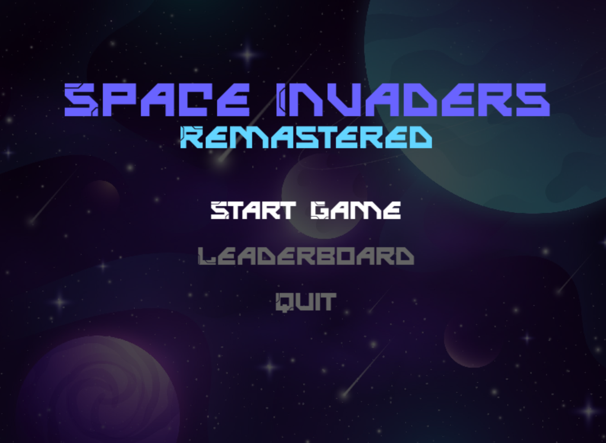

# Space Invaders Remastered

Space Invaders Remastered is a modern take on the classic arcade game Space Invaders, created using Python and Pygame. In this game, players control a spaceship and must shoot down waves of aliens while avoiding their projectiles.



## Features

- Randomly generated alien grids with increasing difficulty
- Different types of aliens
- Sound effects and background music
- Level progression system
- Player lives and scoring system
- Game over and level complete screens
- Pause menu with options to resume or quit the game

## How to Run

1. Ensure you have Python 3.7 or later installed on your system. You can download Python from the [official website](https://www.python.org/downloads/).

2. Install the required dependencies:
    ```
    pip install -r requirements.txt
    ```

3. Run the game using the following command:
    ```
    python main.py
    ```

## How to Play

- Use the left and right arrow keys to move your spaceship horizontally.
- Press the spacebar to shoot bullets at the aliens.
- Clear all aliens to complete a level and proceed to the next level.
- The game ends when you run out of lives or if you choose to quit from the pause menu.
- Press "Escape" to pause the game, and press "Spacebar" to resume or "Escape" again to quit.

## Future Suggestions

- Add power-ups for the player (e.g., shield, rapid fire, extra life)
- Implement boss battles at certain levels
- Integrate a high score system with an online leaderboard
- Add more diverse alien types and behaviors
- Include a settings menu to configure game options (e.g., sound levels, difficulty, controls)


## License

Copyright (c) 2023 Souvik Biswas

Permission is hereby granted, free of charge, to any person obtaining a copy
of this software and associated documentation files (the "Software"), to deal
in the Software without restriction, including without limitation the rights
to use, copy, modify, merge, publish, distribute, sublicense, and/or sell
copies of the Software, and to permit persons to whom the Software is
furnished to do so, subject to the following conditions:

The above copyright notice and this permission notice shall be included in all
copies or substantial portions of the Software.

THE SOFTWARE IS PROVIDED "AS IS", WITHOUT WARRANTY OF ANY KIND, EXPRESS OR
IMPLIED, INCLUDING BUT NOT LIMITED TO THE WARRANTIES OF MERCHANTABILITY,
FITNESS FOR A PARTICULAR PURPOSE AND NONINFRINGEMENT. IN NO EVENT SHALL THE
AUTHORS OR COPYRIGHT HOLDERS BE LIABLE FOR ANY CLAIM, DAMAGES OR OTHER
LIABILITY, WHETHER IN AN ACTION OF CONTRACT, TORT OR OTHERWISE, ARISING FROM,
OUT OF OR IN CONNECTION WITH THE SOFTWARE OR THE USE OR OTHER DEALINGS IN THE
SOFTWARE.